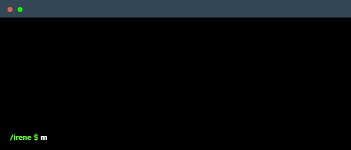

<!--
    Hey there, I'm Irene Sofia Franco!
    Happy to see you here exploring my README code
    Feel free to inspire!
-->
 

   

&nbsp;<a href="https://git.io/typing-svg">
- *Bachelor's Degree in Digital Humanities* at University of Pisa on May 30th, 2024.
- Interested in programming websites and graphic contents. Intend to become a Graphic and Web Designer
</a>

---
&nbsp;<a href="https://git.io/typing-svg">
- Italian (native language)
- English (C1)
- Spanish (A2)

&ensp;
&nbsp;
&nbsp;
&nbsp;
&ensp;
&nbsp;
&ensp;
&nbsp;
&ensp;
&ensp;
&ensp;
&ensp;
&ensp;
&ensp;
&ensp;
&ensp;
&ensp;
&ensp;
&nbsp;
&ensp;
&ensp;
&ensp;
&ensp;
&ensp;
&ensp;

</a>

---
&nbsp;
 
https://isfranco.github.io/Neurocosmo-L-Universo-Neurodiverso 
https://valeriamoscati.altervista.org/
 
https://isfranco.github.io/Syberia/

